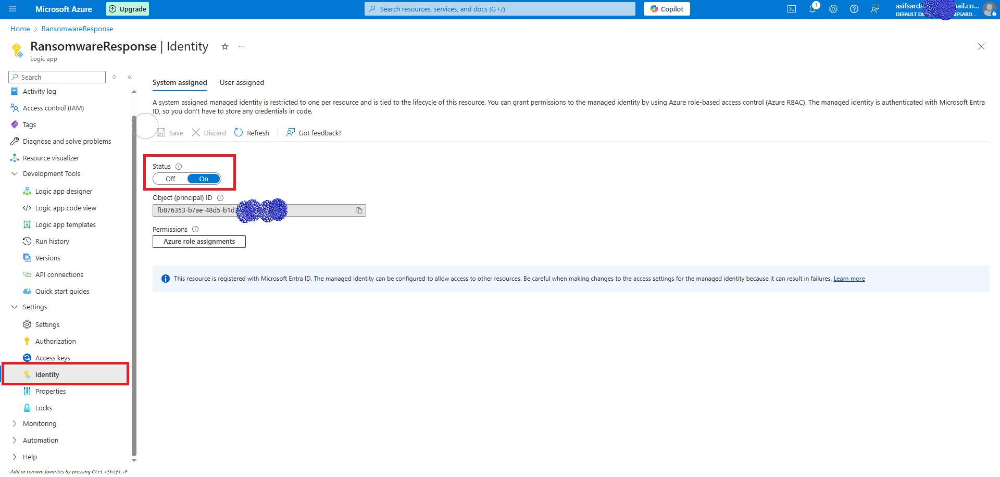
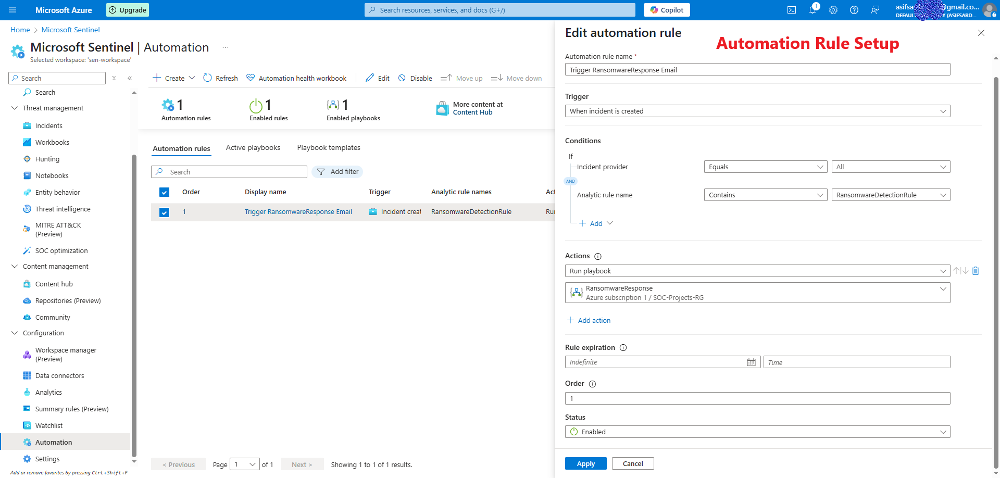

# 💼Microsoft Sentinel Ransomware Detection and Response

A cloud-native **SIEM** project leveraging **Microsoft Sentinel**, **Azure Arc**, **AlienVault OTX Threat Intelligence**, and **Logic Apps** to detect and respond to ransomware-like activities in a Windows VM environment. This project demonstrates **automated incident response** workflows, **threat intelligence integration**, and **analytics rule creation** for a robust security operations pipeline.

---

## 📖 Project Overview

This project builds an **end-to-end Security Operations Center (SOC)** pipeline to detect and respond to ransomware threats using **Microsoft Sentinel**. Key components include:
- **Log Ingestion**: Collecting Windows Security Events from an **Azure Arc-connected Windows 10 VM**.
- **Threat Intelligence**: Ingesting **Indicators of Compromise (IOCs)** from **AlienVault OTX** using a custom **Python** script.
- **Ransomware Simulation**: Mimicking ransomware behavior with safe **file creation** scripts.
- **Detection**: Creating **KQL-based analytics rules** to identify suspicious file creation events.
- **Automated Response**: Triggering **email alerts** via **Logic Apps** for incident response.

This project showcases skills in **cloud security**, **SIEM/SOAR**, **threat intelligence**, and **automation**.

---

## 🛠️ Technologies Used

- **Microsoft Azure**: Sentinel, Log Analytics Workspace, Azure Arc, Logic Apps
- **AlienVault OTX**: Open-source threat intelligence platform
- **Python**: For IOC ingestion (`requests`, `hmac`, `base64`)
- **Kusto Query Language (KQL)**: For log analysis and detection rules
- **PowerShell**: For simulating ransomware behavior and VM onboarding
- **Windows 10 VM**: Hosted on **Oracle VirtualBox**, connected via **Azure Arc**

---

## 📋 Project Setup and Workflow

### 1. Azure Environment Setup
- **Resource Group**: `Incident-Response-Sentinel`
- **Log Analytics Workspace**: `Sen-Workspace`
- **Microsoft Sentinel**: Enabled on the workspace
- **Windows 10 VM Onboarding**:
  - Connected a **Windows 10 VM** (hosted on **Oracle VirtualBox**) to **Azure Arc** using the following **PowerShell** commands:
    ```powershell
    Set-ExecutionPolicy -Scope CurrentUser -ExecutionPolicy RemoteSigned
    .\OnboardingScript.ps1
    ```
  - The `OnboardingScript.ps1` was provided by **Azure Arc** during the onboarding process to register the VM with the **Log Analytics Workspace**.
- **Connected Windows 10 VM**

### 2. Log Ingestion
- Configured the **Windows Security Events** connector in **Microsoft Sentinel** to collect **Windows Security Events** from the **Azure Arc-connected Windows 10 VM**.
- Verified log ingestion with **KQL** query:
  ```kql
  SecurityEvent | take 10
  ```
- Confirmed events like **Event ID 4663** were successfully ingested for ransomware detection.
- **Log Ingestion Output Screenshot**

### 3. Threat Intelligence Integration
- **AlienVault OTX**: Fetched **IOCs** (IPs, domains, file hashes) from pulse `682c98241f65c148621d6ae1` using a **Python** script.
- **Python Script**: `otx_to_sentinel.py` ingests **IOCs** into **Sentinel’s** `OTX_IOCs_CL` custom table.
  ```python
  import requests
  import json
  import hashlib
  import hmac
  import base64
  from datetime import datetime

  OTX_API_KEY = "55bb174d9c701930c0f8f40f1c7e6dbb1f021a86a82e8ed3e8***********"
  OTX_PULSE_ID = "682c98241f65c************"
  workspace_id = "97dd4e69-b6bb-4333-bc39-8f9372eb136**********"
  shared_key = "nEdGaI4Q+Yl9dM/jsV4bk6NGtdYfYopyRq8q4fGqAcTXrQMZDFFkCYLOgQpfDXH************"
  log_type = "OTX_IOCs"

  # Fetch IOCs
  headers = {"X-OTX-API-KEY": OTX_API_KEY}
  response = requests.get(f"https://otx.alienvault.com/api/v1/pulses/{OTX_PULSE_ID}", headers=headers)
  indicators = response.json().get("indicators", [])

  # Send to Sentinel
  def build_signature(date, content_length, method, content_type, resource):
      x_headers = f"x-ms-date:{date}"
      string_to_hash = f"{method}\n{content_length}\n{content_type}\n{x_headers}\n{resource}"
      bytes_to_hash = string_to_hash.encode("utf-8")
      decoded_key = base64.b64decode(shared_key)
      encoded_hash = base64.b64encode(hmac.new(decoded_key, bytes_to_hash, hashlib.sha256).digest()).decode()
      return f"SharedKey {workspace_id}:{encoded_hash}"

  def post_data_to_sentinel(ioc):
      body = json.dumps(ioc)
      method = "POST"
      content_type = "application/json"
      resource = "/api/logs"
      rfc1123date = datetime.utcnow().strftime('%Y-%m-%dT%H:%M:%SZ')
      content_length = len(body)
      signature = build_signature(rfc1123date, content_length, method, content_type, resource)
      uri = f"https://{workspace_id}.ods.opinsights.azure.com{resource}?api-version=2016-04-01"
      headers = {
          "Content-Type": content_type,
          "Authorization": signature,
          "Log-Type": log_type,
          "x-ms-date": rfc1123date
      }
      response = requests.post(uri, data=body, headers=headers)
      if response.status_code in [200, 202]:
          print(f"✔️ Sent: {ioc['indicator']}")
      else:
          print(f"❌ Failed: {ioc['indicator']}")

  for ioc in indicators:
      post_data_to_sentinel(ioc)
  ```
- Verified **IOC** ingestion with the following **KQL** queries:
- **For All**
    ```kql
    OTX_IOCs_CL | where TimeGenerated > ago(7d) | take 1000
    ```
- **IOC Log Ingestion**


- **IP Addresses**:
    ```kql
    OTX_IOCs_CL
    | where TimeGenerated > ago(1h)
    | where type_s == "IPv4" or type_s == "IPv6"
    | project TimeGenerated, indicator_s, type_s, description_s
    | sort by TimeGenerated desc
    | take 20
    ```
- **Filter with IP Addresses**


  - **Domains**:
    ```kql
    OTX_IOCs_CL
    | where TimeGenerated > ago(1h)
    | where type_s == "domain"
    | project TimeGenerated, indicator_s, type_s, description_s
    | sort by TimeGenerated desc
    | take 20
    ```
- **Filter with IP Domain**


  - **File Hashes**:
    ```kql
    OTX_IOCs_CL
    | where TimeGenerated > ago(1h)
    | where type_s in ("FileHash-SHA1", "FileHash-SHA256", "FileHash-MD5")
    | project TimeGenerated, indicator_s, type_s, description_s
    | sort by TimeGenerated desc
    | take 20
    ```
- **Filter with FileHash**

### 4. Ransomware Simulation
- Simulated ransomware by creating a file with a **PowerShell** command:
  ```powershell
  New-Item -Path "C:\Test\encrypted_$((Get-Date).ToString('yyyyMMdd_HHmmss')).txt" -ItemType File -Value "Simulated ransomware payload" -Force
  ```
- Verified **Event ID 4663** in **Sentinel**:
  ```kql
  SecurityEvent | where EventID == 4663 and ObjectName contains "encrypted" | take 10
  ```
- **Ouput with Event ID 4663**

### 5. Analytics Rule Creation
- Created a **Scheduled Analytics Rule** (`RansomwareDetectionRule`) in **Sentinel**:
  - **Query**:
    ```kql
    SecurityEvent | where EventID == 4663 and ObjectName has "encrypted" | summarize count() by Account, Computer, ObjectName
    ```
  - **Frequency**: Every **5 minutes**
  - **Threshold**: Trigger if **> 0 results**
  - **Entity Mapping**: **Account**, **Host**
  - **MITRE ATT&CK**: **Impact (T1486)**
- **Analytics Rule Setup**

### 6. Automated Incident Response
- Built a **Logic App** (`RansomwareResponse`) with a **Sentinel incident trigger**.
- Configured **Send Email (V3)** to notify with incident details and a manual **VM stop** link.
- Enabled **Managed Identity** and assigned **Microsoft Sentinel Automation Contributor** role to resolve permission issues.
- Linked to an **Automation Rule** to trigger the **Logic App** on new incidents.
- **Logic App Design & Email Details**
- **After an Alert Email Received**
- **Managed Identity Permission**
- **Automation Rule Setup**

---

## 📈 Results and Outcomes

- Successfully ingested **Windows Security Events** and **OTX IOCs** into **Microsoft Sentinel**.
- Detected simulated ransomware activity (**Event ID 4663**) with a **KQL-based analytics rule**.
- Automated incident response with **email alerts** containing actionable details.
- Overcame challenges like **TAXII connector failures**, **IP join issues**, and **Logic App permissions**.
- **Key Metrics**:
  - **IOCs ingested**: ~50+ from **OTX pulse**
  - **Detection latency**: <**5 minutes**
  - **Email alert delivery**: ~**1 minute** post-incident

---

## 🚀 Future Enhancements

- **Advanced Detection**: Integrate **Sysmon** logs for richer event data.
- **Automation**: Use **Azure Arc Run Command** to automate **VM shutdown**.
- **Alert Tuning**: Add suppression (e.g., **1-hour**) to reduce noise.
- **Threat Hunting**: Develop **KQL** queries to correlate **IOCs** with network events.

---

## 📝 How to Reproduce

1. **Setup Azure**:
   - Create a **Resource Group** and **Log Analytics Workspace**.
   - Enable **Microsoft Sentinel**.
   - Onboard a **Windows VM** via **Azure Arc** using:
     ```powershell
     Set-ExecutionPolicy -Scope CurrentUser -ExecutionPolicy RemoteSigned
     .\OnboardingScript.ps1
     ```

2. **Install Python Dependencies**:
   ```bash
   pip install requests
   ```

3. **Run IOC Ingestion**:
   - Save `otx_to_sentinel.py` in `C:\OTX_Sentinel`.
   - Update `OTX_API_KEY`, `workspace_id`, `shared_key`.
   - Execute:
     ```bash
     python otx_to_sentinel.py
     ```

4. **Simulate Ransomware**:
   - Run:
     ```powershell
     New-Item -Path "C:\Test\encrypted_$((Get-Date).ToString('yyyyMMdd')).txt" -ItemType File -Value "Simulated ransomware payload" -Force
     ```

5. **Verify Detection**:
   - Check **Sentinel Logs** with provided **KQL queries**.
   - Confirm incidents in your GitHub repo.

6. **Setup Automation**:
   - Create a **Logic App** with a **Sentinel trigger** and **email action**.
   - Assign **Managed Identity** permissions.
   - Link to an **Automation Rule**.

---

## 📚 Lessons Learned

- **Threat Intelligence**: Manual **IOC** ingestion is a reliable fallback when **TAXII** connectors fail.
- **KQL**: Schema validation (e.g., `ObjectName` vs `FileName`) is critical for accurate detection.
- **Automation**: **Managed Identities** simplify permission management in **Azure** deployments.
- **VM Constraints**: Non-native **Azure VMs** limit some automation (e.g., network adapter control).

---

## 🤝 Acknowledgments

- **AlienVault OTX**: For providing open-source **threat intelligence**.
- **Microsoft Azure**: For the **Sentinel** and **Logic Apps** platform.

---

## 📬 Contact

Feel free to reach out for questions or collaboration:
- **LinkedIn**: https://www.linkedin.com/in/md-asif-sardar-386457296/
- **Email**: sardarasif376@gmail.com

---
END...
